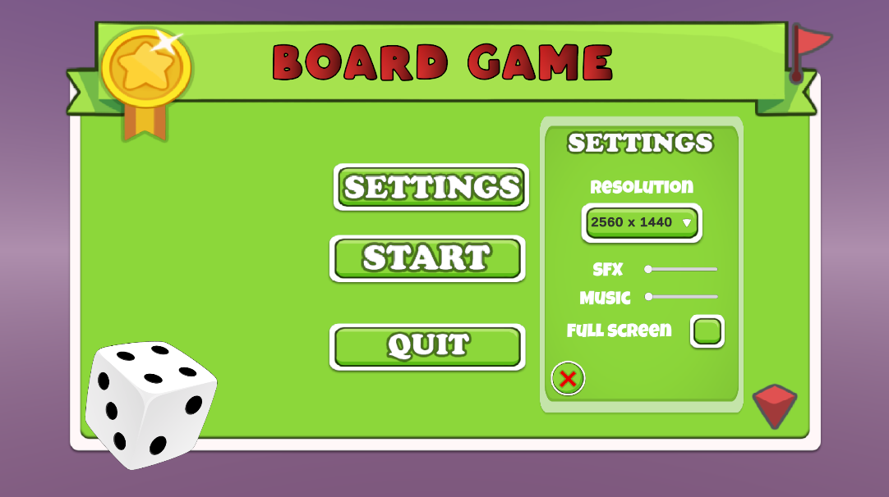
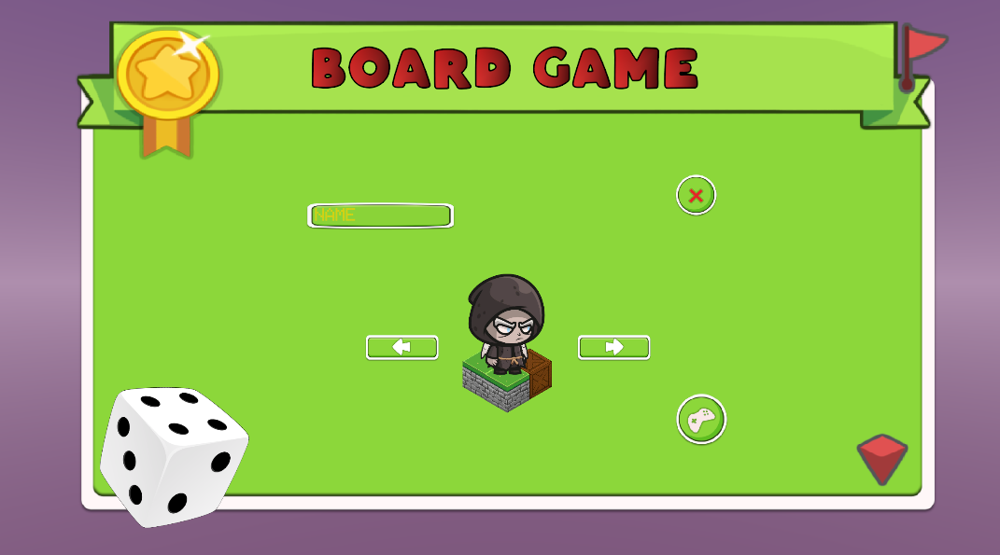
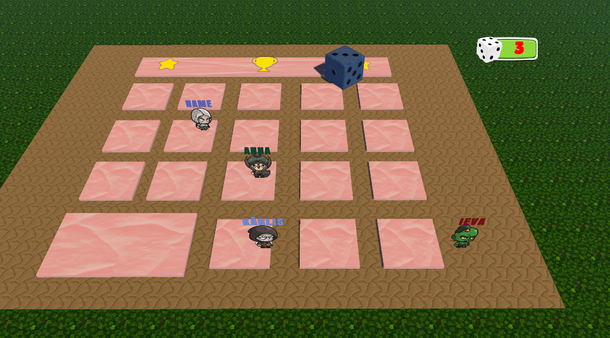
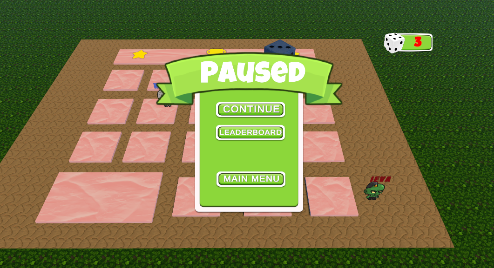
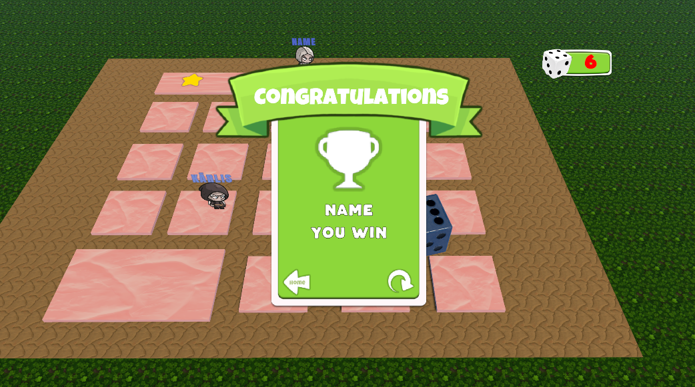

# 🎲 Board Game

A colorful, turn-based **board game** where players roll dice, move across tiles, and race to victory.  
Simple rules, clear visuals, and just enough chaos to blame the dice instead of your skills.

---

## 🏠 Main Menu

From the **Main Menu**, you can:

- ▶ **Start** – Begin a new game
- ⚙ **Settings** – Adjust game options
- ❌ **Quit** – Exit the game

---

## ⚙️ Settings

Available options:

- **Resolution selection**
- **SFX volume**
- **Music volume**
- **Fullscreen toggle**

Changes apply immediately and affect gameplay visuals and audio.

---

## 👤 Player Setup

Before starting the game:

- Enter your **player name**
- Select your **character/avatar** using left and right arrows

Your chosen name appears above your character during gameplay.

---

## 🎲 Gameplay

- Players take turns **rolling the dice**
- Each roll moves the character forward on the board
- The objective is to **reach the final tile first**
- Player names are displayed above characters for clarity

This is a **turn-based game** — no timers, no rush, just dice and destiny.

---

## ⏸️ Pause Menu

🔑 **The pause screen opens when `ESC` is pressed**

Available options:

- ▶ **Continue** – Resume the game
- 🏆 **Leaderboard** – View rankings
- 🏠 **Main Menu** – Return to the main menu

The game is fully paused while this menu is open.

---

## 🏆 Win Screen

When a player reaches the final tile:

- A **Congratulations screen** is shown
- The **winning player’s name** is displayed
- Options to:
  - Return to main menu
  - Restart the game

Dice were involved. Responsibility is optional.

---

## 🖥️ Controls

| Action | Key |
|------|-----|
| Pause Game | `ESC` |
| Navigate Menus | Mouse |
| Select / Confirm | Mouse Click |

---

## 📌 Summary

**Board Game** is built around:

- Clean and readable UI  
- Simple turn-based mechanics  
- Casual, accessible gameplay  

Perfect as a standalone game or a foundation for future features like special tiles, power-ups, or multiplayer madness.

---

🎲 *Roll responsibly.*
